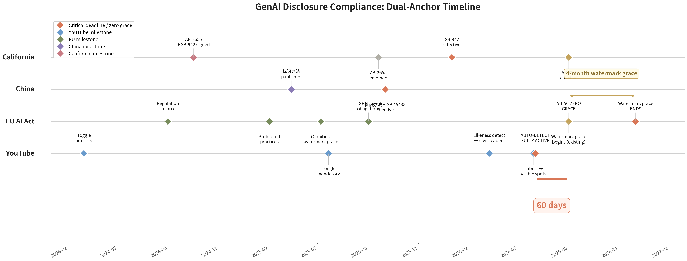
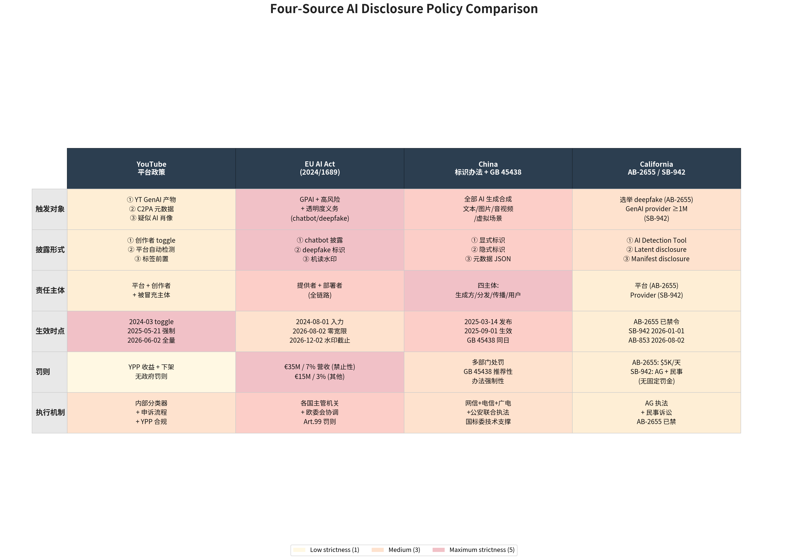

# AI 视频标注合规指南：YouTube × EU AI Act × 中国标识办法 × 加州 SB-942

> YouTube 2026-06-02 全量启动平台主动检测，距 EU AI Act 2026-08-02 Article 50 全面适用整整 60 天。这 60 天把全球 GenAI 治理的实际起算日，从立法日推到了平台落地日。

---

## Abstract

2026 年 6 月 2 日，YouTube 把"平台主动检测 AI 合成内容"扩展到全量用户场景。同年 8 月 2 日，欧盟《人工智能法案》（后文以"AI Act"代称）第 50 条（后文以"Art.50"代称）透明度义务、第 99 条罚则全面适用[^1][^2]。两个日期相隔 60 天。

5 月 7 日的"AI Act Omnibus"协议被普遍解读为"延期"，实际只给了存量系统在机器可读水印一项上 4 个月宽限至 2026-12-02；chatbot 披露、deepfake 标签、通用型人工智能（后文以"GPAI"代称）模型义务全部维持 8/2 零宽限[^3]。新系统上线即合规。罚则上限 3500 万欧元或全球营收 7%[^4]，高于 GDPR 的 4%。

本文从 AI 视频创作者第一视角，论证 YouTube 6/2 主动检测的本质是商业平台对 AI Act Art.50、中国《人工智能生成合成内容标识办法》（后文以"《标识办法》"代称）传播平台核验义务、加州 SB-942 披露路径三大辖区合规公约数的提前对齐；GenAI 治理的实际起算日已从立法日切换到平台落地日。

---

## 1. Timeline: The 60-Day Window



| 日期 | 事件 | 来源 |
|------|------|------|
| 2025-09-01 | 中国《标识办法》+ GB 45438-2025（后文以"GB 国标"代称）同步施行 | [^5][^6] |
| 2026-01-01 | 加州 SB-942 生效，罚则 5000 美元/天/违规 | [^7] |
| 2026-03-10 | YouTube 官方 blog 公告 likeness detection 扩展至公职人员、记者 | [^8] |
| 2026-05-30 | PPC Land 披露 May 2026 disclosure 框架更新 | [^9] |
| 2026-06-02 | YouTube 平台主动检测全量启动（事实锚）| [^10] |
| 2026-08-02 | AI Act Art.50 / 99 全面适用（制度锚），AB-853 同日生效 | [^1][^2] |
| 2026-12-02 | AI Act 存量系统水印补齐截止（4 个月宽限唯一项）| [^3] |
| 2027-12 | AI Act 高风险 AI 义务到期 | [^3] |

时间锚说明：YouTube 主动检测存在三个并行日期——官方 blog 3/10、PPC Land 5/30、xix.ai / TechCrunch 6/2。本文采纳 6/2 作为主锚，对应媒体广泛报道日，也是创作者群体普遍感知到变化的那一天。

---

## 2. Three-Layer Labeling: 一个视频被标了三次

我那条上周发的 AI 配音短片，被标了三次——前两次根本看不到。

### 2.1 第一层：平台显式标签

YouTube 的 "Altered or synthetic content" 标签，显式 toggle 自 2024-03 上线、2025-05-21 强制执行；2026 年 5 月起前置到播放器与描述区"viewers will actually see"的位置[^9]。这层给观众看。

### 2.2 第二层：平台隐式水印

Content ID + C2PA（内容来源认证标准）元数据。用户看不见，但下游抓取工具——剪辑软件、二次分发平台、检测站点——都能机读出来。视频只要离开 YouTube，"AI 出身"已钉在文件里。6/2 之后被强化：YouTube 内部分类器现在主动检测三类触发源——自有 GenAI 工具产物（Veo、Fantasia Canvas 等）、携带 C2PA 元数据的外部内容、分类器命中的疑似肖像合成[^8]。

### 2.3 第三层：制度性标记

- EU：Art.50 §2 要求合成输出"machine-readable + detectable as artificially generated"；§4 要求 deepfake 部署者向自然人明示披露[^11]。
- 中国：《标识办法》要求显式 + 隐式双标识，元数据强制字段包括 AIGC 标识、内容生产者、生产编号[^5]：

```json
{
  "AIGC": {
    "Label": "1",
    "ContentProducer": "生产者名称",
    "ProduceID": "生产编号"
  }
}
```

责任链拆成四层：生成方、应用商店、传播平台、用户——用户恶意删除或篡改标识也违法。

- 加州：SB-942 强制 Latent Disclosure（隐式）字段包括提供商名、AI 系统名+版本、生成日期时间、唯一 ID；同时支持可选 Manifest Disclosure（显式）[^7]。

三层叠在一起，怪事就来了：同一条视频，平台标一次，EU 要求部署者再明示一次，中国传播平台看不到标识还要主动补风险提示。三层标记互不通气，合规责任却叠加在创作者头上。

### 2.4 技术现实：水印根本造不出来

Article 50 要求的"经过常规处理不可去除"的机器可读水印，技术上还不成熟。Tech Fast Forward 直接挑明[^4]：

> *"Article 50 requires watermarks that are robust and not removable by normal processing; every current approach including SynthID and C2PA has documented failure modes under standard image operations."*

Google 的 SynthID、行业联盟的 C2PA，截图、裁剪、转码、二次压缩之后都会失效——这些都是用户日常操作。立法在追一个还没造出来的标准。

---

## 3. Cross-Jurisdiction Analysis: 一次抢跑了三家辖区

### 3.1 60 天时差的实质

8/2 是 AI Act Art.50 全面适用日，管的是平台和 GPAI 提供者，不是创作者。条文要求 chatbot 告诉用户对面是 AI，deepfake 明示披露，GPAI 合成输出"机器可读且可被检测"。听起来跟视频创作者没直接关系。

但 6/2，YouTube 把这套逻辑提前压到了创作者头上。Axis Intelligence 泼了冷水[^3]：

> *"Here is what most coverage of the May 7 deal missed: the extension does not touch August 2, 2026. That date remains the live enforcement trigger for the AI Act's Article 50 transparency obligations."*

5 月 7 日 Omnibus 协议根本没碰 8/2。chatbot 披露、deepfake 标签、GPAI 义务准时落地，零宽限。唯一被宽限的是机器可读水印：8/2 前已上市的存量系统可拖到 12/2 再补齐，4 个月缓冲[^3]：

> *"The Omnibus grants a four-month grace period on this specific requirement for systems already on the market before August 2... New systems launched after August 2 get no grace period."*

平台不想等 8/2 被欧盟拿着 3500 万欧元或全球营收 7% 的罚单做首批典型化执法。它提前 60 天，用自己的检测系统先把"可识别 + 可披露"跑通[^4]。

### 3.2 EU 写法 vs 中国工程规范

EU Article 50 写的是义务原则——"machine-readable + detectable"——具体怎么实现，留给市场和后续 Code of Practice（行为准则）。GPAI Code of Practice on Transparency 2025-12-17 才发布第一稿、2026-06 定稿；截至 2026 年初，27 个成员国只有 8 个指定了国家主管机关[^12]。

中国 GB 国标是 2025-09-01 与《标识办法》同步实施的强制性国标。文本、音频、图像、视频、虚拟场景五类，标识方法挨个写死，元数据 JSON 字段名都定好了[^6]。

两边写法不同：EU 留了实现空间给后续行业准则，中国已经把字段名写死了。如果 EU 将来要把"机器可读水印"落到字段级别，最现成的参考可能不在布鲁塞尔，而在中国国标里。

### 3.3 加州对照样本：一败一立

加州 AB-2655 强制平台对选举 deepfake 做下架，2025 年 8 月 20 日被 Senior U.S. District Judge John A. Mendez 以 Section 230 抢占为由永久禁令（Kohls v. Bonta）[^13]。"强制 removal"在美国联邦法框架下走不通。

同期生效的 SB-942 走了另一条路：披露 + 检测工具，覆盖月活 100 万以上的 GenAI 提供商，强制提供免费 AI Detection Tool（含 API），罚则 5000 美元/violation/day，2026-01-01 已生效[^7]。配套 AB-853（2026-08-02 生效）进一步扩展平台披露义务。

一败一立，结论直白：GenAI 治理可执行的路径只剩"标记 + 披露 + 工具"，"强删"已被堵死。YouTube 6/2 上线的 detect + disclose + 主体申诉，恰好同时对齐 AI Act Art.50、中国办法传播平台核验义务、加州 SB-942 披露路径。一次抢跑的对象是三大辖区共同的合规公约数。



---

## 4. Outlook

合规没有"应对一次"这种说法。8/2 之后紧跟着 12/2 存量系统补水印截止；加州 AB-853 同样卡在 8/2；欧盟成员国主管机关下半年陆续到位，第一批 Art.50 / 第 99 条典型化执法大概率在 8/2 之后几个月内出现。3500 万欧元或 7% 全球营收这把刀挂在那儿，是真要落下来的。

对创作者而言，三个判断要先做出来：

1. 平台落地日 ≠ 立法生效日，但合规义务从前者起算。盯紧"我常用的平台"在不在主动检测，比盯"哪国哪法什么时候生效"更实用。
2. 三层标记叠加是常态，互相不通气。同一条 AI 内容在不同辖区可能被不同主体重复标记，合规责任在创作者侧叠加。
3. 水印技术尚无可用标准是机会窗口。EU AI Office 也承认水印技术不成熟——技术路线、字段格式、互操作规范还有定义空间。

12/2/2026 第二道大限会再来一次。8/2 之后首批典型化执法落地时，会出现第一次"算法性裁判 vs 创作者举证"的拉锯。本文将以 v2 版本在 8/2 后复盘。

---

## 5. 后记：写完才发现

这篇文章写完存档的时候，我发现项目空间已经给文件头自动塞了一段 AI 生成内容标识的 frontmatter。我没勾任何选项。

这跟开头那条视频的情况一模一样——"我没点它，它自己出现了"。6/2 那天是 YouTube 替我打了标签，今天是我的写作工具替我盖了戳。标记这件事，已经不需要你同意了。

---

## References

[^1]: European Parliament & Council. *Regulation (EU) 2024/1689 (AI Act) Full Text*. EUR-Lex. https://eur-lex.europa.eu/eli/reg/2024/1689/oj (fetched: 2026-06-09)

[^2]: European Commission. *Article 50 — Transparency obligations*. AI Act Service Desk. https://ai-act-service-desk.ec.europa.eu/en/ai-act/article-50 (fetched: 2026-06-09)

[^3]: Axis Intelligence. *EU AI Act 2026: The August Deadline Wasn't Cancelled*. 2026-06-06. https://axis-intelligence.com/eu-ai-act-2026-compliance/ (fetched: 2026-06-06)

[^4]: Tech Fast Forward. *EU AI Act Signals 35M Fines as Deadline Hits August 2026*. 2026-06-08. https://techfastforward.com/articles/eu-ai-act-signals-35m-fines-as-deadline-hits-august-2026 (fetched: 2026-06-08)

[^5]: 国家互联网信息办公室等四部门. 《人工智能生成合成内容标识办法》（网信办通字〔2025〕2 号），2025-03-14 发布，2025-09-01 施行. https://www.cac.gov.cn/2025-03/14/c_1743654684782215.htm (fetched: 2026-06-09)

[^6]: 国家市场监督管理总局. *GB 45438-2025 网络安全技术 人工智能生成合成内容标识方法*. 国家标准全文公开系统. https://openstd.samr.gov.cn/bzgk/std/newGbInfo?hcno=F32EA2A561F1886CD8D606513512D547 (fetched: 2026-06-09)

[^7]: California Legislative Information. *SB-942 California AI Transparency Act Full Text*. https://leginfo.legislature.ca.gov/faces/billTextClient.xhtml?bill_id=202320240SB942 (fetched: 2026-06-09)

[^8]: YouTube Blog. *Expanding likeness detection to civic leaders and journalists*. 2026-03-10. https://blog.youtube/news-and-events/expanding-likeness-detection-civic-leaders-journalists/ (fetched: 2026-06-09)

[^9]: PPC Land. *YouTube shifts generative AI labels to spots viewers will actually see*. 2026-05-30. https://ppc.land/youtube-shifts-generative-ai-labels-to-spots-viewers-will-actually-see/ (fetched: 2026-06-09)

[^10]: xix.ai / TechCrunch. *YouTube expands AI deepfake detection to politicians, government officials and journalists*. 2026-06-02. https://xix.ai/ainews/youtube-expands-ai-deepfake-detection-to-politicians-government-officials-and-journalists.html (fetched: 2026-06-09)

[^11]: AI Buzz. *EU AI Act Explained: A Beginner-Friendly Compliance Guide*. 2026-06-05. https://aibuzz.blog/eu-ai-act-explained/ (fetched: 2026-06-05)

[^12]: European Commission Digital Strategy. *Navigating the AI Act FAQs*. https://digital-strategy.ec.europa.eu/en/faqs/navigating-ai-act (fetched: 2026-06-09)

[^13]: Alliance Defending Freedom. *Kohls v. Bonta · 2025-08-20 Permanent Injunction Order PDF*. Case No. 2:24-cv-02527-JAM-CKD, E.D. Cal. https://adflegal.org/wp-content/uploads/2025/08/babylon-bee-v-bonta-2025-08-20-order-final-judgment-pi-ab-2655.pdf (fetched: 2026-06-09)

[^14]: 24AI Global. *EU AI Act hits full force in August 2026*. 2026-06-07. https://www.24aiglobal.com/article/eu-ai-act-august-2026-everything-you-need-to-know (fetched: 2026-06-07)

[^15]: YouTube Help Center. *Disclosing AI-generated content*. https://support.google.com/youtube/answer/14328491 (fetched: 2026-06-09)

---

*— v3 · 2026-06-12 — v4 · 2026-06-20 (added resources section)*

---

## 📚 Additional Resources

- **[Quick Reference](quick-reference_v1.md)** — One-page cheat sheet (print-friendly)
- **[Creator Checklist](creator-checklist_v1.md)** — 5-minute pre-publish compliance self-check
- **[FAQ](FAQ_v1.md)** — 18 predicted Q&A for comment section
- **[v2 Roadmap](v2-roadmap.md)** — Post-8/2 update plan with milestones
- **[GitHub Pages](https://daniel-24-life.github.io/yt-ai-vs-eu-ai-act/)** — Styled landing page
