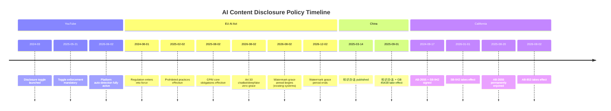

# Dual-Anchor Timeline: YT 6/2 → EU 8/2 → CN 9/1 → EU 12/2

## Key Dates

| Date | Event | Anchor | Source |
|------|-------|--------|--------|
| 2024-03 | YouTube "altered or synthetic" disclosure toggle launched | — | YouTube Help Center |
| 2024-08-01 | EU AI Act (Regulation 2024/1689) enters into force | — | EUR-Lex |
| 2024-09-17 | California Gov. Newsom signs AB-2655 + SB-942 | — | CA Governor |
| 2024-12 | YouTube likeness detection preview (CAA partnership) | — | YouTube Blog |
| 2025-02-02 | EU AI Act: prohibited practices take effect | Institutional | EU AI Act Art.5 |
| 2025-03-14 | China《人工智能生成合成内容标识办法》published | — | CAC |
| 2025-05-07 | EU "AI Act Omnibus" signed — watermark grace period confirmed | — | Axis Intelligence |
| 2025-05-21 | YouTube mandatory disclosure toggle enforcement | — | YouTube Help Center |
| 2025-08-02 | EU AI Act: GPAI core obligations take effect | Institutional | EU AI Act |
| 2025-08-20 | AB-2655 permanently enjoined (Kohls v. Bonta) | — | ADF Legal |
| 2025-09-01 | China 标识办法 + GB 45438-2025 take effect | Institutional | CAC / SAMR |
| 2025-10 | YouTube YPP 4M creators grayscale rollout | — | YouTube |
| 2026-01-01 | California SB-942 takes effect | Institutional | CA Legislature |
| 2026-03-10 | YouTube Blog: likeness detection expands to public officials/journalists | — | YouTube Blog |
| 2026-04 | YouTube likeness detection expands to entertainment (CAA/UTA/WME/Untitled) | — | YouTube |
| **2026-05-30** | PPC Land reports YouTube shifting AI labels to visible spots | Fact | PPC Land |
| **2026-06-02** | YouTube platform-side auto-detection fully active (media-wide reporting) | **Fact Anchor** | xix.ai / TechCrunch |
| **2026-08-02** | EU AI Act Art.50 transparency fully active: chatbot disclosure + deepfake labeling **zero grace**; machine-readable watermark for new systems **zero grace** | **Institutional Anchor** | EUR-Lex / Axis Intelligence |
| **2026-08-02** | Existing systems: watermark 4-month grace period begins | Institutional | EU AI Act Omnibus |
| 2026-08-02 | California AB-853 takes effect (same date) | Institutional | CA Legislature |
| **2026-12-02** | EU AI Act: machine-readable watermark grace period ends for pre-8/2 systems | **Second Deadline** | EU AI Act Omnibus |
| 2027-08-02 | EU AI Act: high-risk product transition complete | Institutional | EU AI Act |
| 2027-12 | EU AI Act: high-risk AI (recruitment/credit/education) deadline | Institutional | EU AI Act |

## Mermaid Timeline

## The 60-Day Gap

The critical insight: YouTube's June 2 platform-side detection preceded the EU's August 2 regulatory deadline by exactly **60 days**. During this window, compliance obligations were already de facto enforced by the platform — shifting the burden from "wait for regulation" to "respond to platform policy."

## The Second Deadline: 12/2

The Omnibus gave a 4-month grace period on machine-readable watermarking for systems already on the market before 8/2. **New systems launched after 8/2 get zero grace.** This means December 2, 2026 is the second deadline — and the watermark technical standard still has no working implementation.

---

*Timeline v1 — last updated 2026-06-09*
